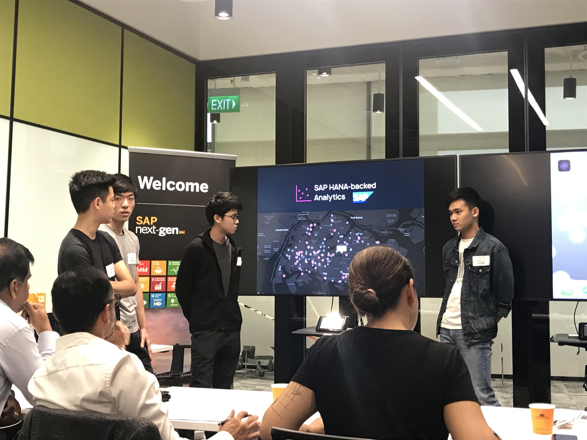
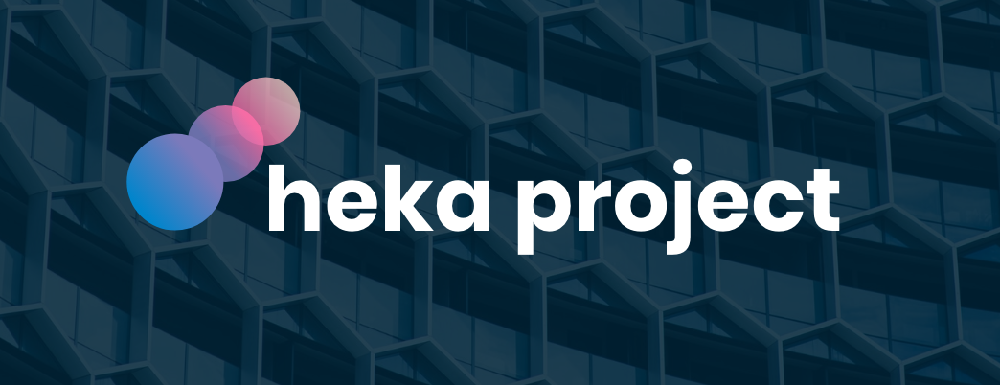
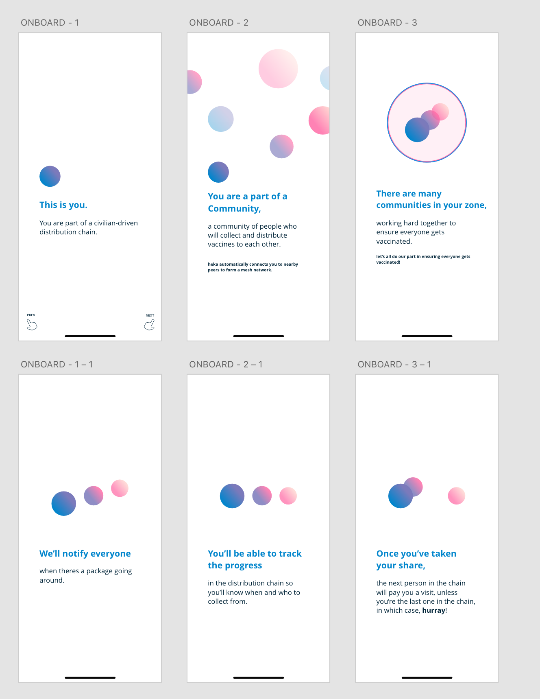
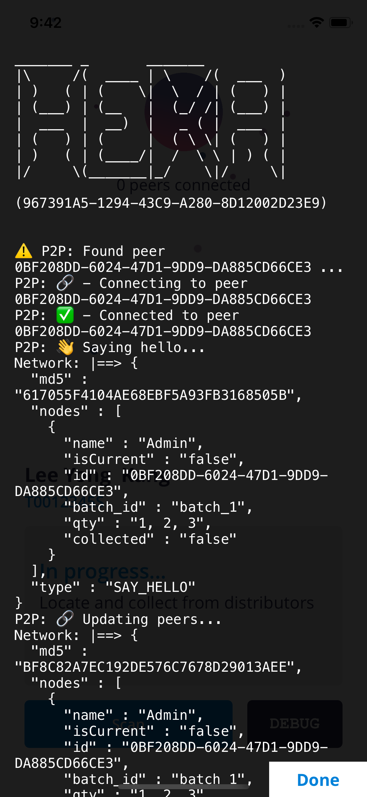

# Re-thinking our project

Since the hackathon, we reviewed and discussed the feedback that we received in order to determine our next steps.

Some important issues from feedback that we got from the SAP panel, and reflections was:

- Security of transaction records
- Viability in countries without proper identification standards
- Scalability of backend system

In lieu of the oncoming assignments, we decided that it was probably best to build on top of our existing projects, we also still had an admin dashboard to work on, Jeremy and Yong Kang took responsibility for this segment.

### Shift of focus

After the hackathon, we discussed that our project should be more focused on the technology behind the decentralized last-mile delivery method, rather than the application of it to vaccine distribution.

> Our reasoning was that we already got the affirmation we needed from winning the first hackathon about the usefulness of this technology.

And so, we felt that this project would be much more interesting if we explored deeper into improving the technology, rather than creating a polished product.

## Re-design

With our new focus, I redesigned and simplified the iOS App with debuggability in mind.

I patched up most of the bugs in the P2P Library with the help of a nifty debugger to make transaction handling more reliable.

Here you can peek into the details of interactions between other peers on the network, allowing us to debug on-the-go and accross all test devices.
